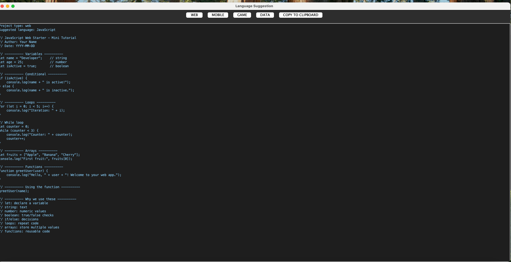
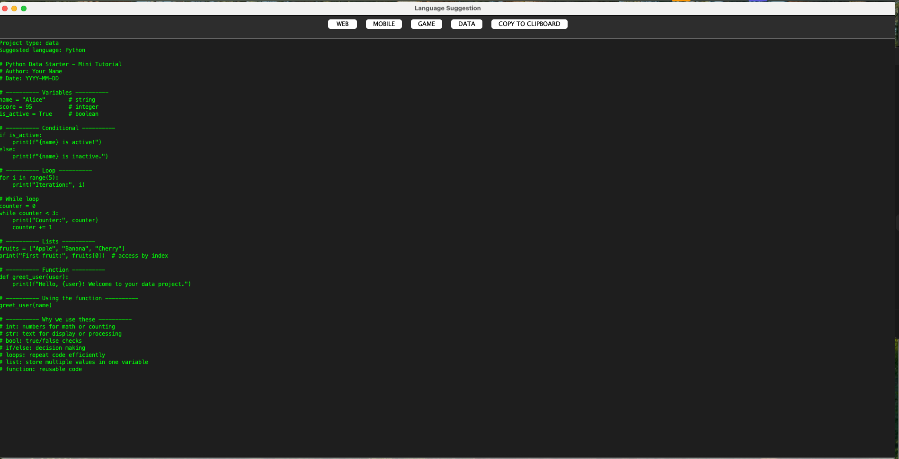
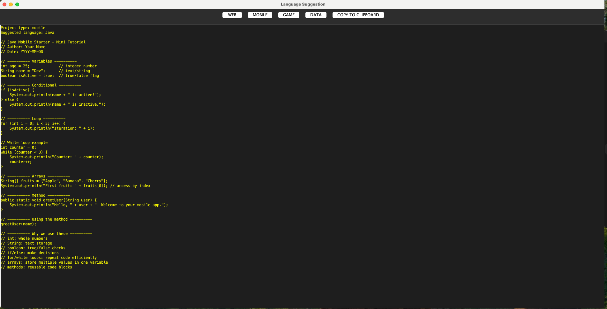
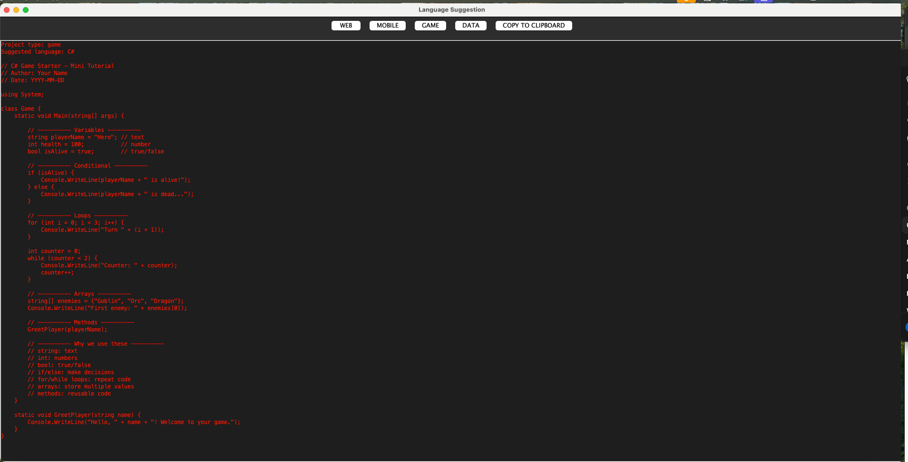
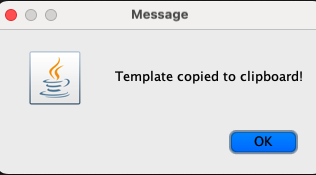

# Language Suggestion

**Language Suggestion** is a beginner-friendly Java application that helps users choose the appropriate programming language for their project type. The program also provides starter templates with explanations, making it a learning tool as well as a quick project initializer.  

---

## Features

- Suggests a programming language based on project type:  
  - Web → JavaScript  
  - Mobile → Java  
  - Game → C#  
  - Data Analysis → Python  
- Provides in-depth starter templates with comments and real-world examples  
- Color-coded text output for each project type for easy reading  
- Runs in the terminal or via a desktop launcher (Mac `.command`)  
- Multi-run support: users can try multiple project types without restarting  

---

## Getting Started

### Prerequisites

- Java JDK installed on your system  
- macOS or Windows terminal for running the CLI version  

### Running the Program

1. Clone the repository:  
```bash
git clone https://github.com/your-username/LanguageSuggestion.git
cd LanguageSuggestion


1## 🖥️ Program in Action

Below are screenshots showing the program running and demonstrating its core features:

### 🌐 Web Project Suggestion (JavaScript)


### 📊 Data Analysis Suggestion (Python)


### 📱 Mobile Project Suggestion (Java)


### 🎮 Game Project Suggestion (C#)


### 📋 Clipboard Functionality (Planned Feature)


Compile the Java program:

bash
Copy
Edit
javac LanguageSuggestion.java
Run the program in terminal:

bash
Copy
Edit
java LanguageSuggestion
Optionally, on macOS, use the .command file to launch the program with a double-click.

Templates
All templates are located in the templates folder and include:

JavaMobile.txt – Starter template for mobile projects

JavaScriptWeb.txt – Starter template for web projects

CSharpGame.txt – Starter template for game projects

PythonData.txt – Starter template for data analysis projects

Each template contains explanations of core programming concepts and practical examples.

License
This project is licensed under the MIT License. See the LICENSE file for details.

Future Enhancements
Add copy-to-clipboard functionality for templates

Include interactive exercises for beginners

Expand templates to cover more languages and frameworks

Implement a GUI version with color-coded sections
